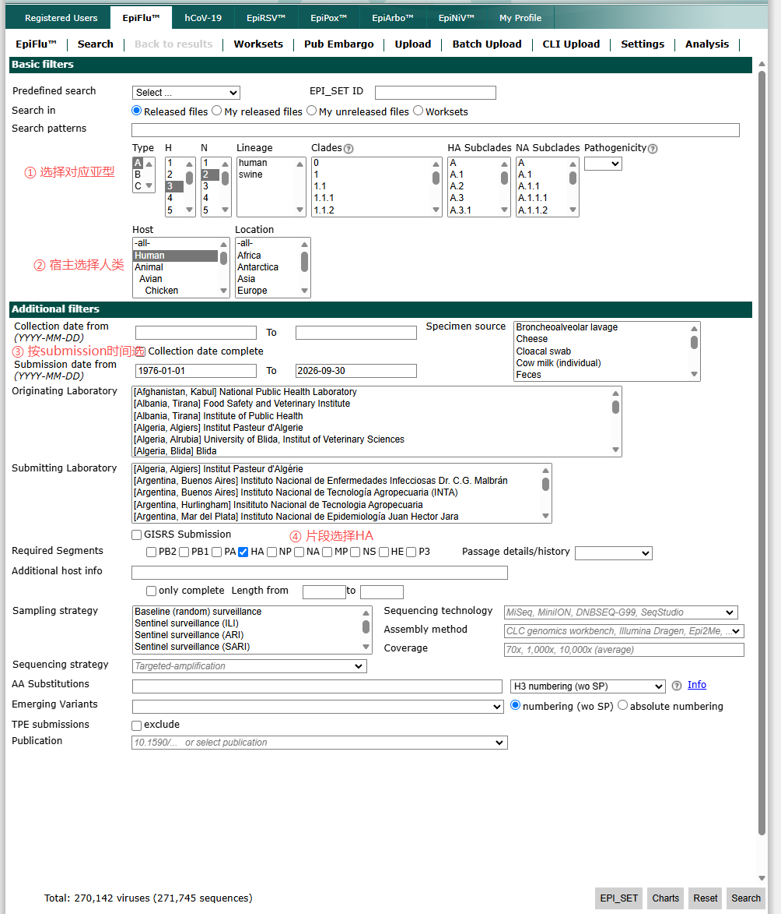
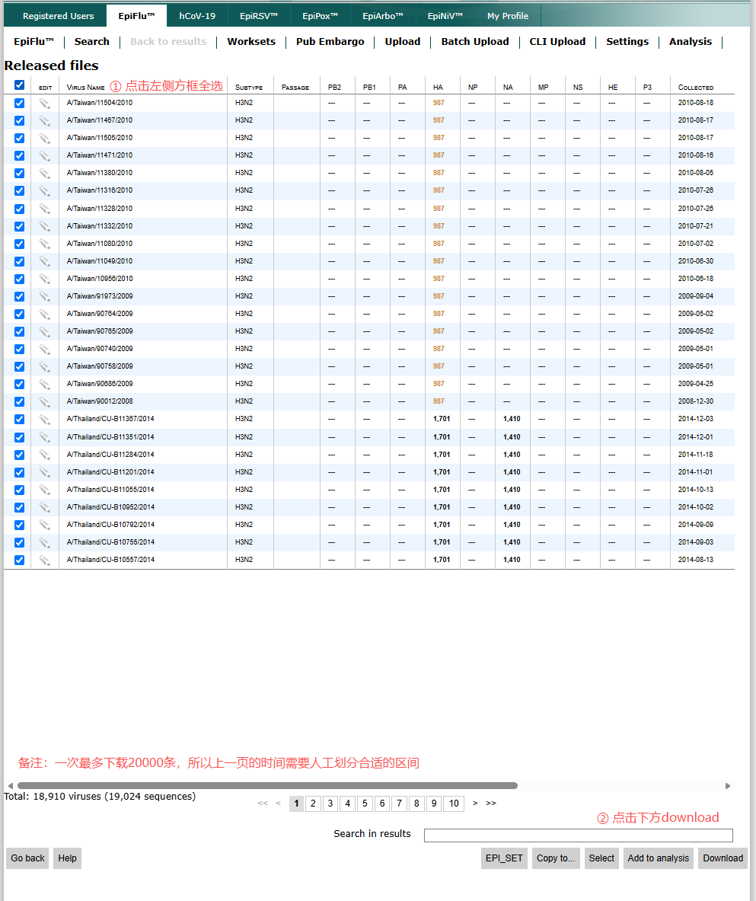
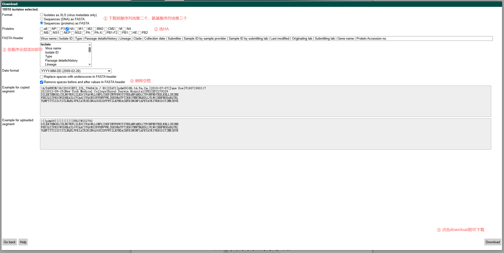
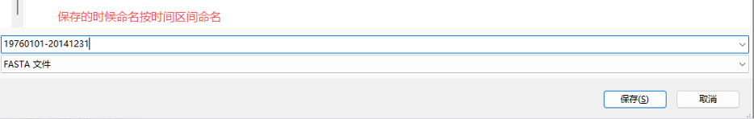

# Alright-strain

H3N2 流感病毒 HA 序列的下载与 Nextclade clade 批量注释操作指南。

## 项目目录

- `data/raw/`：不可由本项目重建的原始 FASTA 与 Nextclade TSV；分析代码只读取这里的数据。
- `data/interim/`、`data/processed/`：分别存放可再生成的中间数据与可供模型直接消费的规范化数据。
- `configs/`：subclade 与 strain 预测实验的参数配置。
- `outputs/<run_id>/`：一次运行的预测、指标、图和 `manifest.json`；manifest 固化输入哈希和最终参数。
- `analysis/`：探索性 notebook；可复用逻辑应进入 `src/`，而不是只留在 notebook 中。

## 工作流程

1. 在 GISAID EpiFlu 中检索并分批下载 H3N2 HA 序列。
2. 整理得到 FASTA 文件（下文以 `H3N2_HA_RNA_all.fasta` 为例）。
3. 安装 Nextclade CLI 并下载 H3N2 HA 参考数据集。
4. 批量运行 Nextclade，生成 clade 注释结果表。

> [!IMPORTANT]
> GISAID 数据的访问、下载和使用应遵守 GISAID 的注册用户协议与数据使用条款。本文不提供或再分发 GISAID 序列数据。

## 一、从 GISAID 下载 H3N2 HA 序列

### 1. 设置检索条件

进入 GISAID 的 EpiFlu 检索界面并设置：

1. 在 `Type`、`H` 和 `N` 中选择目标亚型，例如 `A`、`H3`、`N2`。
2. 在 `Host` 中选择 `Human`。
3. 在 `Submission date from/to` 中填写提交日期范围，例如 `1976-01-01` 至 `2014-12-31`。
4. 在 `Required Segments` 中勾选 `HA`。
5. 点击右下角的 `Search`。



### 2. 选中序列并控制下载批次

1. 在结果页点击左上角表头的复选框，全选当前结果中的序列。
2. 点击页面右下角的 `Download`，进入下载配置页。

> [!WARNING]
> GISAID 单次最多下载 20,000 条序列。如果检索结果超过限制，请返回检索页，将日期范围拆分为多个较小区间后分批下载。



### 3. 配置 FASTA 下载参数

1. 在 `Format` 中选择需要的序列格式：
   - 核酸序列：`Sequences (DNA) as FASTA`
   - 氨基酸序列：`Sequences (proteins) as FASTA`
2. 下载蛋白序列时，在 `Proteins` 中勾选 `HA`。
3. 在 `FASTA Header` 配置区，按顺序将所需字段加入表头。原操作流程使用全部可选字段，例如 `Virus name`、`Isolate ID`、`Type`、`Passage details/history` 和 `Lineage` 等。
4. 勾选 `Remove spaces before and after values in FASTA header`，删除字段前后的空格，避免后续程序解析失败。
5. 检查页面中的序列示例，确认格式无误后点击右下角的 `Download`。



### 4. 规范命名并保存

使用本批次的检索日期区间命名下载文件。例如，检索范围为 1976-01-01 至 2014-12-31 时，可命名为：

```text
19760101-20141231.fasta
```

将文件保存到项目数据目录。多个批次应分别保留日期范围，便于追踪、核对和后续合并。



## 二、使用 Nextclade 批量注释 H3N2 clade

### 环境与示例文件

- 操作系统：macOS
- 工作目录：`~/Desktop/H3N2_RNA/`
- 输入文件：`H3N2_HA_RNA_all.fasta`
- 输出文件：`h3n2_clade_results.tsv`

> [!NOTE]
> 原始操作记录使用 `/Desktop/H3N2_RNA/`。通常 macOS 用户桌面的实际路径是 `~/Desktop/H3N2_RNA/`，即 `/Users/<用户名>/Desktop/H3N2_RNA/`。以下命令使用更常见的用户目录写法；如文件位于其他位置，请相应修改路径。

### 1. 安装 Nextclade CLI

以下命令适用于 Intel（x86_64）Mac：

```bash
curl -fsSL \
  "https://github.com/nextstrain/nextclade/releases/latest/download/nextclade-x86_64-apple-darwin" \
  -o nextclade

chmod +x nextclade
sudo mv nextclade /usr/local/bin/
```

验证安装：

```bash
nextclade --version
```

成功输出版本号后即可继续。

Apple Silicon（M 系列）Mac 请改用 ARM64 版本：

```bash
curl -fsSL \
  "https://github.com/nextstrain/nextclade/releases/latest/download/nextclade-aarch64-apple-darwin" \
  -o nextclade

chmod +x nextclade
sudo mv nextclade /usr/local/bin/
```

### 2. 下载 H3N2 HA 参考数据集

创建工作目录，并下载基于 `A/Wisconsin/67/2005` 毒株的 H3N2 HA 数据集：

```bash
mkdir -p ~/Desktop/H3N2_RNA

nextclade dataset get \
  --name 'nextstrain/flu/h3n2/ha/CY163680' \
  --output-dir ~/Desktop/H3N2_RNA/dataset_h3n2_ha
```

运行完成后，工作目录中会出现 `dataset_h3n2_ha` 文件夹。

Nextclade 数据集会随时间更新。运行下面的命令可检查该数据集名称是否仍在当前可用列表中：

```bash
nextclade dataset list --only-names | grep 'flu/h3n2/ha'
```

如列表中的 H3N2 HA 数据集名称已变化，请根据分析需要选择合适的参考序列，并将 `--name` 的值替换为列表中的完整名称。

### 3. 批量运行 clade 鉴定

确认参考数据集和输入序列均已准备好，然后运行：

```bash
nextclade run \
  --input-dataset ~/Desktop/H3N2_RNA/dataset_h3n2_ha \
  --output-tsv ~/Desktop/H3N2_RNA/h3n2_clade_results.tsv \
  ~/Desktop/H3N2_RNA/H3N2_HA_RNA_all.fasta
```

运行结束后，可在工作目录中找到结果文件：

```text
~/Desktop/H3N2_RNA/h3n2_clade_results.tsv
```

该 TSV 文件可使用 Excel、R、Python 或其他表格分析工具打开，进行后续筛选和统计。

## Benchmark 模型与方法

为全面评估深度学习模型的预测能力，benchmark 同时纳入学习型/进化预测方法（A 组）和传统 baseline（B 组）。A 组用于比较不同建模范式的预测能力，B 组用于检验模型是否真正优于简单外推和成熟的传统频率预测方法。

| 编号 | 工具/方法 | 定位 | 为什么值得 benchmark | 建模简单原理 | 输入 → 输出；是否适合本任务 |
|---|---|---|---|---|---|
| **A1** | **Previr / Łuksza–Lässig framework** | 综合病毒进化预测 | 最权威，专门做 viral evolution prediction；覆盖 H3N2、H1N1pdm09、B/Vic、SARS-CoV-2，并提供持续更新的 clade fitness / frequency prediction。([PubMed Central](https://pmc.ncbi.nlm.nih.gov/articles/PMC11092427/)) | 基于 timed strain tree 追踪 clade frequency、clade fitness、allele trajectory，再结合序列、流行病学、抗原/中和数据预测未来 clade frequency。([Previr](https://www.previr.org/science)) | 输入：序列、时间、地区、clade、抗原/中和/流行病学数据；输出：clade fitness + 未来 clade frequency。**非常适合，但复现成本最高。** |
| **A2** | **CovTransformer** | 深度学习直接预测 | 任务形式最贴合：直接预测 lineage frequency curve；论文称其在 SARS-CoV-2 lineage frequency forecasting 中优于 Nextstrain MLR。([OUP Academic](https://academic.oup.com/ve/article/10/1/veae086/7890856)) | 用 Transformer 从 noisy lineage frequency time series 中学习未来频率轨迹。 | 输入：过去若干 bin 的 lineage/subclade frequency；输出：未来 frequency curve。**形式很适合，但不是 influenza-specific，需要迁移到 H1。** |
| **A3** | **Site-based mutation dynamics / beth-1** | 位点级进化预测 | Nature Communications 2024，专门面向 influenza evolution；用 genome-wide mutation frequency dynamics 做未来病毒群体预测。([Nature](https://www.nature.com/articles/s41467-024-46918-0)) | 先预测各位点突变频率/fitness landscape，再据此推断未来更接近病毒群体的候选株或优势变异。 | 输入：多时点 HA/NA 或全基因组序列、突变频率、免疫/血清信息；输出：未来优势突变、fitness landscape、候选代表株。**适合作辅助 benchmark，但不天然输出完整 subclade proportion curve。** |
| **B0** | **Current frequency / persistence** | naive lower bound | 检验模型是否真的超过“当前比例不变”。 | 将预测截断点的当前频率直接复制到所有未来时间点。 | 输入：截断点的 region × bin × subclade counts/frequency；输出：未来各 bin 的 subclade frequency。**完全适合，作为最低基线。** |
| **B1** | **Nextstrain forecasts-flu MLR** | 主 baseline | 官方 Nextstrain 生态中的成熟 frequency forecast 方法。 | 通过多元线性回归整合频率趋势与 fitness predictors，外推未来 clade frequency。 | 输入：历史 clade frequency 及相关 predictors；输出：未来 clade frequency。**适合作为主要传统 baseline。** |
| **B2** | **RelRe renewal-equation** | H1-specific 传统对照 | 已有 H1N1pdm09 clade frequency 预测应用，提供机制型对照。 | 使用 renewal equation 和变异株相对繁殖优势描述频率随时间的变化。 | 输入：变异株/亚群的时间序列 counts；输出：相对传播优势及未来 frequency。**适合 H1 任务的机制型对照。** |

### 传统 baseline 的构建与运行

#### B0：Current frequency / persistence

B0 无需单独部署，在数据处理脚本中实现即可。按 `region × bin × subclade` 聚合 counts，计算截断点 `T` 的当前频率，并直接复制到未来 `T+1...T+D` 作为预测，用作最低 naive baseline。

#### B1：Nextstrain forecasts-flu MLR

本地运行 Nextstrain 官方工具：

```bash
git clone https://github.com/nextstrain/forecasts-flu.git
cd forecasts-flu

docker login ghcr.io
docker pull ghcr.io/blab/flu-mlr-fitness:latest

nextstrain build --docker \
  --image=ghcr.io/blab/flu-mlr-fitness:latest .
```

#### B2：RelRe renewal-equation

本地部署 RelRe：

```bash
git clone https://github.com/KimihitoIto/RelRe
cd RelRe

julia install_packages.jl
```

运行示例：

```bash
julia --threads 10 RelRe.jl \
  -i counts.csv \
  -b baseline_variant \
  -c -q \
  -f 90
```

## 常见检查项

- 下载前确认亚型为 H3N2、宿主为 Human、片段为 HA。
- 结果超过 20,000 条时按日期拆分批次。
- 核酸和蛋白 FASTA 不要混淆；Nextclade 命令中的输入应与所用数据集相匹配。
- FASTA 表头去除字段前后空格，减少解析错误。
- 每个下载文件使用明确的日期区间命名，并保留原始文件作为备份。
- 运行 Nextclade 前检查输入文件名、数据集目录和输出路径是否存在且拼写正确。

## 参考资料

- [Nextclade CLI 独立安装说明](https://docs.nextstrain.org/projects/nextclade/en/stable/user/nextclade-cli/installation/standalone.html)
- [Nextclade 数据集说明](https://docs.nextstrain.org/projects/nextclade/en/stable/user/datasets.html)
- [Nextclade CLI 使用说明](https://docs.nextstrain.org/projects/nextclade/en/stable/user/nextclade-cli/usage.html)
